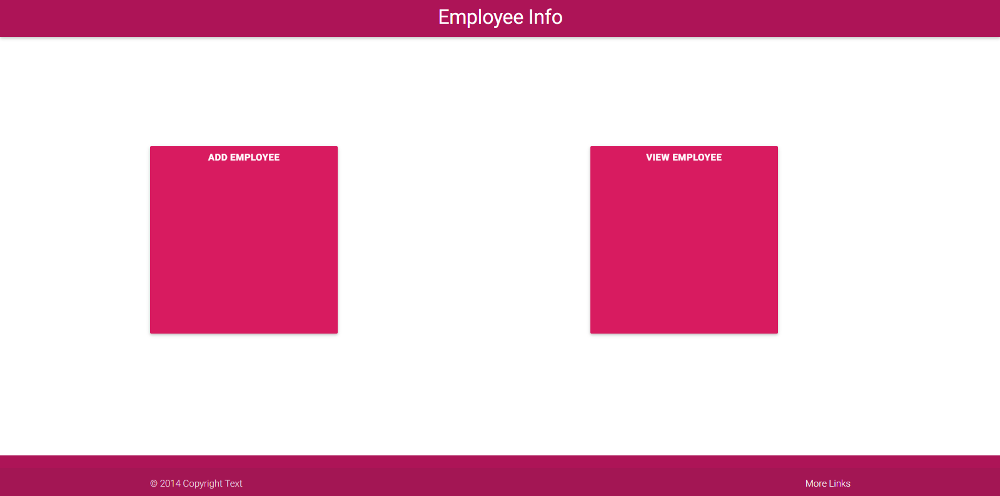
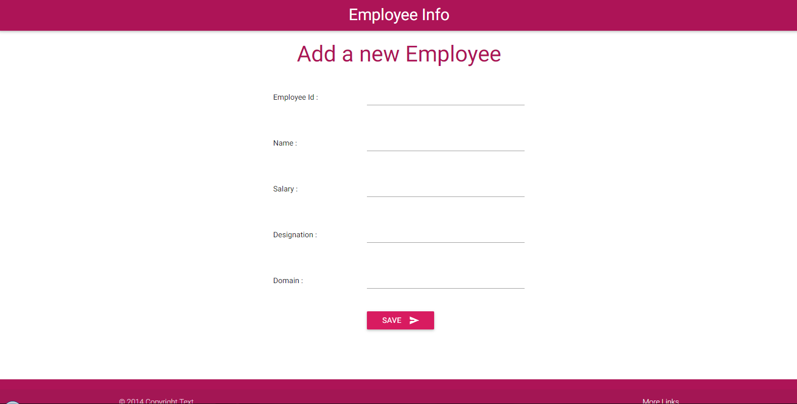
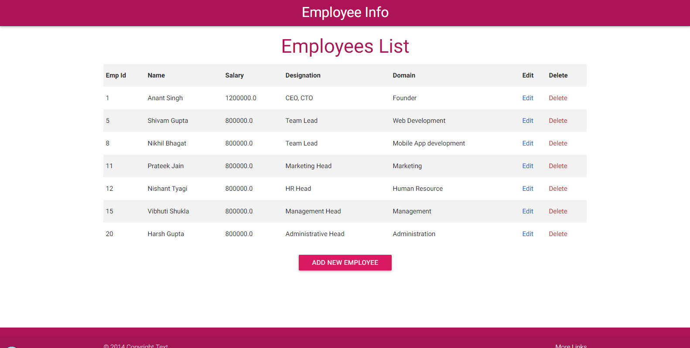
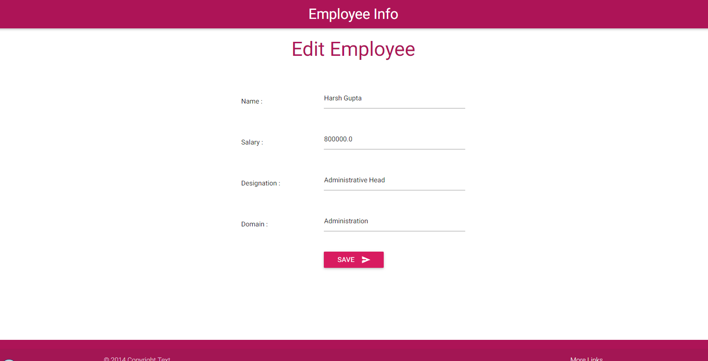

# EmployeeInfo
> Simple Spring boot application with JDBC Template

In this application one can add details about the employee like employee id, employee name,
designation,domain of work, salary and delete or edit it as per need.

### Index Page

### Add Employee Page

### View Employee Page

### Edit Employee Page

  
## Meta

Distributed under the MIT license. See ``LICENSE`` for more information.
